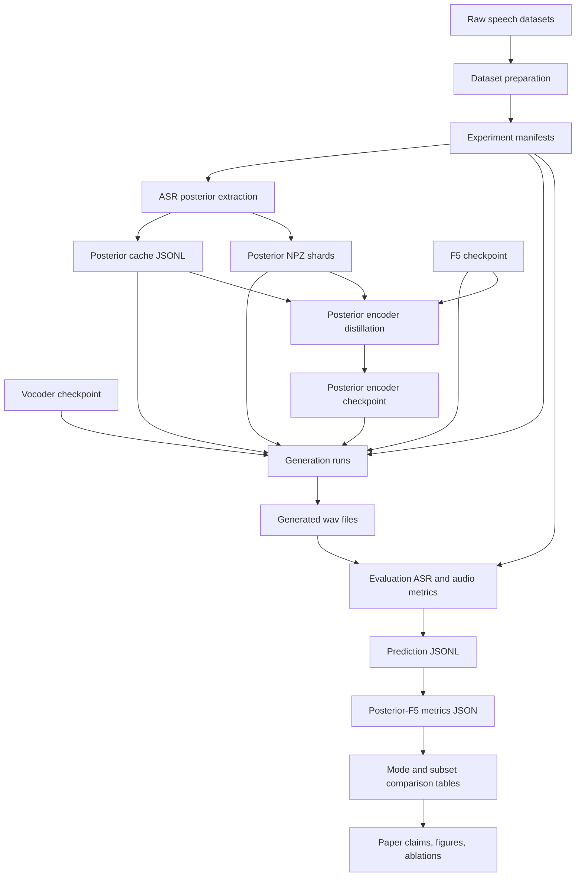
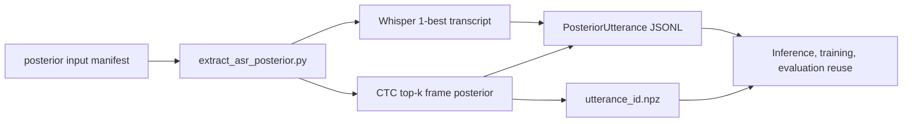
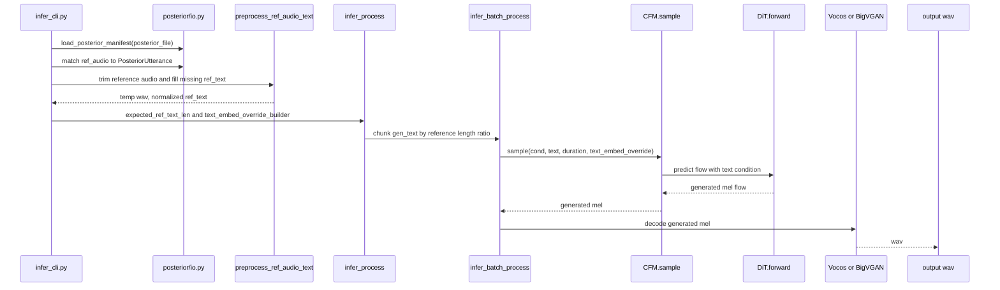
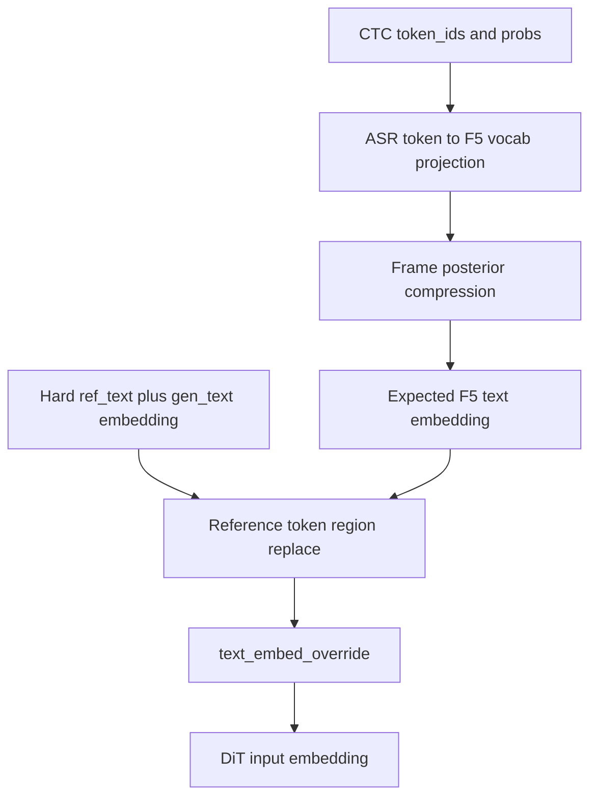
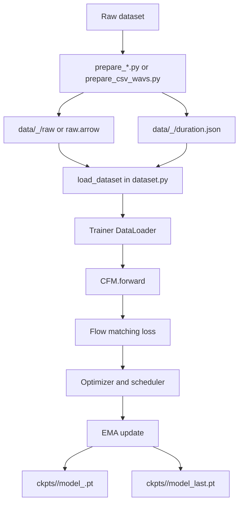
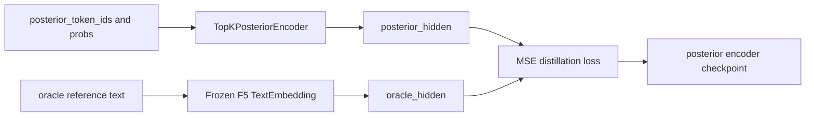
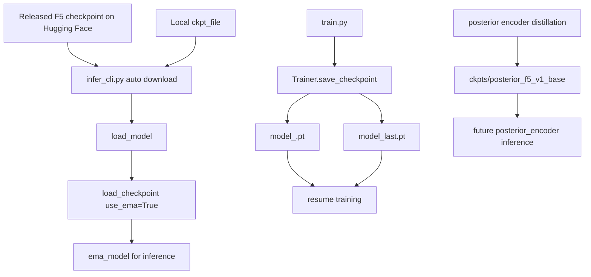
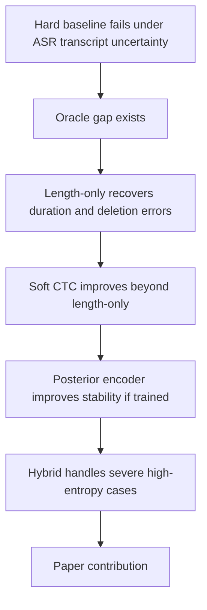
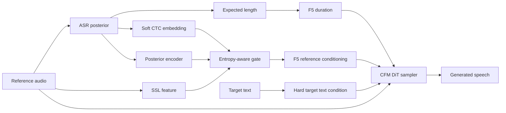

# Posterior-F5 논문 실험 라이프사이클

이 문서는 Posterior-F5 실험을 처음 세팅하는 순간부터, 실제 실험을 돌리고, 결과를 비교하고, 논문 표와 그림으로 정리하는 순간까지의 전체 흐름을 하나로 묶어 설명한다.

핵심 질문은 이것이다.

> ASR이 만든 hard 1-best reference transcript에 F5-TTS가 얼마나 의존하고 있으며, ASR posterior uncertainty를 reference conditioning에 넣으면 그 의존성을 줄일 수 있는가?

현재 코드베이스에서 이미 실행 가능한 것은 `hard`, `length_only`, `soft_ctc` inference baseline과 posterior cache 생성, WER/CER breakdown 평가 경로다. `hybrid`는 CLI 선택지는 있지만 현재 구현상 SSL fallback이 완성된 최종 hybrid는 아니며, `posterior_encoder` 학습 루프는 모듈과 distillation step이 준비된 staged 상태다.

## 1. 전체 그림



큰 흐름은 세 개의 축으로 보면 가장 쉽다.

| 축 | 하는 일 | 대표 파일 |
| --- | --- | --- |
| 데이터 축 | 원본 오디오와 text를 manifest, posterior cache, 평가 reference로 정리 | `manifests/*.jsonl`, `posterior_cache/*.posterior.jsonl` |
| 모델 축 | F5 checkpoint와 posterior 정보를 사용해 wav 생성 | `src/f5_tts/infer/infer_cli.py`, `src/f5_tts/infer/utils_infer.py` |
| 평가 축 | 생성 wav를 별도 ASR와 metric으로 비교하고 논문 표로 변환 | `src/f5_tts/eval/eval_posterior_f5.py`, `src/f5_tts/eval/error_breakdown.py` |

## 2. 저장 경로 지도

권장 경로는 아래처럼 잡는다. 일부 경로는 아직 샘플 또는 권장 구조이고, 실제 대규모 실험에서는 데이터 용량 때문에 git에 넣지 않는다.

```text
F5-TTS/
  data/
    <prepared_dataset>/
      raw/
      mel.arrow
      raw.arrow
      duration.json

  manifests/
    dev_small.jsonl
    full_eval.jsonl
    clean_test.jsonl
    noisy_test.jsonl

  posterior_cache/
    dev_small.posterior.jsonl
    full_eval.posterior.jsonl
    posterior_npz/
      <utterance_id>.npz

  ckpts/
    F5TTS_v1_Base/
      model_1250000.safetensors
    posterior_f5_v1_base/
      model_1000.pt
      model_last.pt

  eval_outputs/
    posterior_f5_baseline/
      hard/
      length_only/
      soft_ctc/
      metrics/

  results/
    <exp_name>_<ckpt_step>/<testset>/

  tmp/smoke/
    hard/hard.wav
    length_only/length_only.wav
    soft_ctc/soft_ctc.wav
    posterior_ctc.jsonl
    posterior_npz/basic_en.npz
    metrics.json
```

경로의 역할은 다음과 같다.

| 경로 | 역할 | git 포함 여부 |
| --- | --- | --- |
| `docs/md/` | 실험 설계, cache format, protocol, 현재 문서 | 포함 |
| `src/f5_tts/posterior/` | posterior schema, I/O, normalize, length, embedding, gating | 포함 |
| `src/f5_tts/scripts/extract_asr_posterior.py` | reference audio에서 ASR transcript와 CTC top-k posterior 추출 | 포함 |
| `src/f5_tts/infer/` | 실제 TTS inference 진입점 | 포함 |
| `src/f5_tts/model/` | CFM, DiT, posterior encoder, dataset wrapper | 포함 |
| `src/f5_tts/eval/` | batch generation, WER/CER breakdown, metric 집계 | 포함 |
| `posterior_cache/` | ASR posterior cache 산출물 | 제외 권장 |
| `eval_outputs/`, `results/` | 생성 wav, metric, 비교 결과 | 제외 권장 |
| `ckpts/` | F5 및 posterior encoder checkpoint | 제외 권장 |
| `wandb/` | 학습 로그 | 제외 권장 |

## 3. 실험 입력 manifest

실험은 manifest 한 줄이 하나의 utterance가 되도록 시작한다.

```json
{"utterance_id":"utt-0001","ref_audio":"data/ref_0001.wav","ref_text":"oracle prompt transcript","gen_text":"target sentence","text":"evaluation reference text","subset":"noisy"}
```

posterior 추출용 manifest는 `audio_path` 중심이다.

```json
{"utterance_id":"utt-0001","audio_path":"data/ref_0001.wav","text":"optional oracle transcript","language":"en"}
```

필드 의미는 다음과 같다.

| 필드 | 의미 |
| --- | --- |
| `utterance_id` | cache, wav, prediction, metric을 묶는 기본 key |
| `ref_audio` 또는 `audio_path` | reference speaker prompt audio |
| `ref_text` | oracle 또는 사용자가 주는 reference transcript |
| `gen_text` | F5가 새로 말해야 하는 target text |
| `text` | 평가할 때 generated wav transcript와 비교할 정답 text |
| `subset` | `clean`, `noisy`, `accented`, `dysarthric` 같은 분석 축 |

논문 실험에서는 최소한 아래 split을 권장한다.

| split | 목적 |
| --- | --- |
| `clean/dev_small` | smoke test, regression, 빠른 디버깅 |
| `clean/test` | clean speech에서 baseline 손상 여부 확인 |
| `noisy/test` | ASR가 흔들릴 때 posterior가 도움이 되는지 확인 |
| `accented/test` | accent로 1-best가 틀릴 때 robust reference conditioning 확인 |
| `dysarthric/test` | severe prompt에서 hard transcript 의존성 한계 확인 |

## 4. Posterior cache 생성



posterior cache는 inference, training, evaluation이 같은 ASR uncertainty를 읽도록 만드는 공통 인터페이스다.

생성 스크립트는 여기다.

```text
src/f5_tts/scripts/extract_asr_posterior.py
```

Whisper 1-best만 저장하려면:

```bash
PYTHONPATH=src python3 src/f5_tts/scripts/extract_asr_posterior.py \
  --manifest manifests/dev_small.jsonl \
  --output posterior_cache/dev_small.posterior.jsonl \
  --language en
```

CTC top-k posterior shard까지 저장하려면:

```bash
PYTHONPATH=src python3 src/f5_tts/scripts/extract_asr_posterior.py \
  --manifest manifests/dev_small.jsonl \
  --output posterior_cache/dev_small.posterior.jsonl \
  --shard_dir posterior_cache/posterior_npz \
  --ctc_model facebook/wav2vec2-base-960h \
  --top_k 8 \
  --language en
```

이미 manifest에 oracle text가 있고 Whisper를 건너뛰려면:

```bash
PYTHONPATH=src python3 src/f5_tts/scripts/extract_asr_posterior.py \
  --manifest manifests/dev_small.jsonl \
  --output posterior_cache/dev_small.posterior.jsonl \
  --skip_whisper
```

산출물은 두 가지다.

| 산출물 | 예시 | 내용 |
| --- | --- | --- |
| JSONL manifest | `posterior_cache/dev_small.posterior.jsonl` | utterance metadata, one-best, n-best, expected length, entropy, shard path |
| NPZ shard | `posterior_cache/posterior_npz/utt-0001.npz` | `token_ids`, `probs` 배열 |

JSONL 한 줄은 `src/f5_tts/posterior/schema.py`의 `PosteriorUtterance` 구조를 따른다.

```text
PosteriorUtterance
  utterance_id
  audio_path
  asr_source
  one_best
  nbest: list[Hypothesis]
  frame_posteriors: TopKPosterior
  token_map: PosteriorTokenMap
  expected_ref_len
  mean_entropy
```

큰 posterior matrix는 JSONL에 직접 넣지 않고 `.npz` shard로 둔다. 읽을 때는 `src/f5_tts/posterior/io.py`의 `load_posterior_manifest()`와 `load_topk_arrays()`가 담당한다.

## 5. Inference 모드와 코드 흐름

현재 CLI 진입점은 다음 파일이다.

```text
src/f5_tts/infer/infer_cli.py
```

주요 옵션은 다음과 같다.

```bash
f5-tts_infer-cli \
  --model F5TTS_v1_Base \
  --ref_audio data/ref.wav \
  --ref_text "" \
  --gen_text "target sentence" \
  --ref_text_mode hard \
  --posterior_file posterior_cache/dev_small.posterior.jsonl \
  --output_dir eval_outputs/posterior_f5_baseline/hard \
  --output_file utt-0001.wav
```

지원 모드의 현재 상태는 다음과 같다.

| mode | CLI 상태 | 의미 | 핵심 코드 |
| --- | --- | --- | --- |
| `hard` | 실행 가능 | 기존 F5 방식. `ref_text`가 없으면 Whisper 1-best를 생성해서 hard text로 사용 | `preprocess_ref_audio_text()` |
| `oracle` | 별도 CLI enum은 아님 | gold reference transcript를 `--ref_text`로 넣은 `hard` 실행. 논문 ceiling | `infer_cli.py` 입력 구성 |
| `length_only` | 실행 가능 | text condition은 hard 그대로 두고 duration 계산만 posterior expected length 사용 | `infer_process()`, `infer_batch_process()` |
| `soft_ctc` | 실행 가능 | CTC posterior를 F5 text embedding 일부에 soft override로 주입 | `_soft_ctc_builder_for_entry()` |
| `hybrid` | placeholder 성격 | CLI 선택지는 있으나 현재는 SSL fallback이 완성되지 않았고 soft tensor를 alpha 1.0으로 통과 | `HybridReferenceConditioner` |
| `posterior_encoder` | 학습형 확장 | evaluation parser와 model module은 있으나 full training loop는 staged | `posterior_encoder.py`, `train_posterior.py` |

Inference 전체 경로는 아래와 같다.



### 5.1 Hard mode

`hard`는 기존 F5-TTS 경로다.

1. `preprocess_ref_audio_text()`가 reference audio를 12초 안쪽으로 trim하고 silence edge를 정리한다.
2. `ref_text`가 비어 있으면 `transcribe()`가 Whisper large-v3-turbo로 reference transcript를 만든다.
3. `ref_text + gen_text`를 text condition으로 만든다.
4. `CFM.sample()`이 reference mel을 condition으로 쓰고 target 부분 mel을 생성한다.
5. vocoder가 mel을 wav로 바꾼다.

이 모드는 논문에서 `F5-hard-1best` baseline이다.

### 5.2 Oracle mode

`oracle`은 현재 별도 CLI mode가 아니다. gold reference transcript를 `--ref_text`로 넣고 `--ref_text_mode hard`로 실행하면 된다.

이 모드는 hard transcript error가 없을 때의 ceiling이다. 논문에서는 oracle과 hard 사이의 gap을 posterior 방법이 얼마나 회복하는지 본다.

```text
oracle_gap_recovered =
  (metric_hard - metric_method) / (metric_hard - metric_oracle)
```

WER처럼 낮을수록 좋은 metric에서는 위 식을 그대로 쓰면 된다.

### 5.3 Length-only mode

`length_only`는 representation은 바꾸지 않고 duration estimation만 바꾼다.

기존 F5 duration 계산은 `ref_text` UTF-8 byte 길이에 의존한다.

```python
ref_text_len = len(ref_text.encode("utf-8"))
gen_text_len = len(gen_text.encode("utf-8"))
duration = ref_audio_len + int(ref_audio_len / ref_text_len * gen_text_len / speed)
```

Posterior-F5에서는 `posterior_cache`의 `expected_ref_len`으로 이 값을 대체할 수 있다.

```python
ref_text_len = posterior_utterance.expected_ref_len
duration = ref_audio_len + int(ref_audio_len / ref_text_len * gen_text_len / speed)
```

관련 파일은 다음과 같다.

| 파일 | 책임 |
| --- | --- |
| `src/f5_tts/posterior/length.py` | n-best posterior weighted length와 CTC occupancy length 계산 |
| `src/f5_tts/infer/infer_cli.py` | posterior entry를 ref audio와 match하고 `expected_ref_text_len` 전달 |
| `src/f5_tts/infer/utils_infer.py` | chunking과 duration 계산에 expected length 적용 |
| `src/f5_tts/api.py`, `src/f5_tts/socket_server.py` | API/socket에서 `length_only` 일부 지원 |

이 baseline은 매우 중요하다. soft embedding이 좋아 보여도 실제 개선이 단순히 duration mismatch 감소 때문인지 분리해야 하기 때문이다.

### 5.4 Soft CTC mode

`soft_ctc`는 frame-level CTC posterior를 F5 text embedding space에 넣는 inference-only baseline이다.



현재 CLI 내부 흐름은 다음과 같다.

1. `infer_cli.py`가 posterior JSONL을 읽는다.
2. `_soft_ctc_builder_for_entry()`가 해당 utterance의 `.npz` shard를 읽는다.
3. `_project_asr_topk_to_f5_ids()`가 CTC token을 F5 vocab id로 변환한다.
4. `_compressed_soft_ref_embed()`가 CTC frame sequence를 reference token length로 압축한다.
5. hard embedding의 reference token 구간만 soft embedding으로 살짝 blend한다.
6. `CFM.sample(..., text_embed_override=...)`로 전달한다.
7. `DiT.get_input_embed()`가 기존 `TextEmbedding.forward()` 대신 override tensor를 사용한다.

관련 파일은 다음과 같다.

| 파일 | 책임 |
| --- | --- |
| `src/f5_tts/posterior/soft_embedding.py` | top-k posterior에서 expected embedding 계산하는 일반 함수 |
| `src/f5_tts/infer/infer_cli.py` | 현재 CLI용 projection, compression, builder |
| `src/f5_tts/model/cfm.py` | `sample()`에 `text_embed_override`를 받아 DiT로 전달 |
| `src/f5_tts/model/backbones/dit.py` | override tensor pad/trim/cache 처리 |

주의할 점은 target text는 hard text로 유지한다는 것이다. 바꾸는 것은 reference audio 쪽 transcript conditioning이다. target text는 사용자가 명시적으로 말하게 하려는 문장이므로 uncertainty source가 아니다.

### 5.5 Hybrid mode

설계상 hybrid는 아래 형태를 목표로 한다.

```text
H_ref = alpha_t * H_soft_text + (1 - alpha_t) * H_ssl
```

`alpha_t`는 posterior entropy와 blank probability가 낮으면 text branch를 더 믿고, 높으면 SSL branch를 더 믿도록 만든다.

현재 준비된 파일은 다음과 같다.

| 파일 | 책임 |
| --- | --- |
| `src/f5_tts/posterior/gating.py` | entropy, blank mass를 text weight로 변환 |
| `src/f5_tts/model/ssl_reference_encoder.py` | SSL feature를 F5 text dimension으로 projection |
| `src/f5_tts/model/hybrid_reference_conditioner.py` | soft text와 SSL tensor mixing |

다만 현재 `infer_cli.py`의 `hybrid` 경로는 실제 SSL feature를 읽지 않는다. 지금 논문 실험에서 hybrid를 최종 결과로 쓰려면 SSL feature extraction과 inference 연결이 추가로 필요하다.

## 6. 학습 흐름

학습은 두 종류로 나눠야 한다.

1. 일반 F5-TTS 학습 또는 finetuning
2. Posterior encoder distillation 학습

### 6.1 일반 F5-TTS 학습



데이터 준비 스크립트는 다음 위치에 있다.

```text
src/f5_tts/train/datasets/
  prepare_emilia.py
  prepare_wenetspeech4tts.py
  prepare_libritts.py
  prepare_ljspeech.py
  prepare_csv_wavs.py
```

학습 진입점은 다음이다.

```bash
accelerate launch src/f5_tts/train/train.py --config-name F5TTS_v1_Base.yaml
```

설정 파일은 `src/f5_tts/configs/*.yaml`에 있다. `train.py`는 Hydra config를 읽어 `CFM`을 만들고, `Trainer`가 optimizer, scheduler, dataloader, EMA, checkpoint 저장을 관리한다.

일반 checkpoint 저장 규칙은 `src/f5_tts/model/trainer.py`에 있다.

| 파일 | 의미 |
| --- | --- |
| `model_<update>.pt` | 지정된 update마다 저장되는 training checkpoint |
| `model_last.pt` | 가장 최근 상태 |
| `ema_model_state_dict` | inference에서 기본으로 쓰는 EMA weight |
| `optimizer_state_dict` | training resume용 optimizer 상태 |
| `scheduler_state_dict` | training resume용 scheduler 상태 |

학습 재개 시 `Trainer.load_checkpoint()`는 우선 `model_last.pt`를 찾고, 없으면 가장 큰 update의 `model_*.pt` 또는 `pretrained_*.safetensors`를 찾는다.

### 6.2 Posterior encoder distillation

Posterior encoder의 목적은 CTC top-k posterior matrix를 F5 text-conditioning space로 직접 사상하는 것이다.



관련 파일은 다음과 같다.

| 파일 | 현재 상태 |
| --- | --- |
| `src/f5_tts/model/posterior_encoder.py` | `TopKPosteriorEncoder`와 `distillation_loss()` 구현 |
| `src/f5_tts/model/posterior_dataset.py` | base dataset에 posterior cache를 붙이는 wrapper 구현 |
| `src/f5_tts/train/train_posterior.py` | config 로드, oracle embedding helper, one-step distillation helper 구현 |
| `src/f5_tts/configs/F5TTS_v1_Base_Posterior.yaml` | posterior encoder config 초안 |

현재 `train_posterior.py`는 full training loop를 바로 돌리지는 않고, dry run과 one-step overfit harness를 먼저 쓰도록 staged 되어 있다.

```bash
PYTHONPATH=src python3 src/f5_tts/train/train_posterior.py \
  --config src/f5_tts/configs/F5TTS_v1_Base_Posterior.yaml \
  --posterior_manifest posterior_cache/dev_small.posterior.jsonl \
  --dry_run
```

full posterior encoder 실험을 논문에 넣으려면 다음이 더 필요하다.

| 필요한 연결 | 설명 |
| --- | --- |
| full dataloader | `PosteriorCacheDataset`과 oracle text tensor 생성 연결 |
| optimizer loop | `posterior_distillation_step()` 반복, logging, checkpoint 저장 |
| inference 연결 | 학습된 encoder checkpoint를 `text_embed_override_builder`로 연결 |
| comparison mode | `posterior_encoder` wav 생성 경로를 mode별 output에 통합 |

## 7. Checkpoint 사용 흐름



Inference에서 checkpoint를 쓰는 방법은 두 가지다.

| 방법 | 설명 |
| --- | --- |
| `--ckpt_file` 생략 | `cached_path()`가 `SWivid/F5-TTS` released checkpoint를 자동 다운로드 |
| `--ckpt_file ckpts/.../model_*.pt` | local 학습 checkpoint를 직접 로드 |

`load_checkpoint(..., use_ema=True)`가 기본이라 inference에는 EMA weight가 들어간다. 아주 짧게 finetune한 checkpoint는 EMA가 pretrained에 너무 가깝게 남을 수 있으므로, 그런 ablation에서는 `use_ema=False` 비교도 기록하는 것이 좋다.

## 8. 결과 저장과 비교

생성 wav는 mode별로 분리해서 저장한다.

```text
eval_outputs/posterior_f5_baseline/
  hard/
    utt-0001.wav
    utt-0002.wav
  oracle/
    utt-0001.wav
  length_only/
    utt-0001.wav
  soft_ctc/
    utt-0001.wav
  metrics/
    hard.metrics.json
    length_only.metrics.json
    soft_ctc.metrics.json
```

단일 CLI 실행 예시는 다음과 같다.

```bash
f5-tts_infer-cli \
  --model F5TTS_v1_Base \
  --ref_audio data/ref_0001.wav \
  --ref_text "" \
  --gen_text "The target sentence to synthesize." \
  --ref_text_mode soft_ctc \
  --posterior_file posterior_cache/dev_small.posterior.jsonl \
  --output_dir eval_outputs/posterior_f5_baseline/soft_ctc \
  --output_file utt-0001.wav \
  --seed 1234
```

대량 평가의 설정 초안은 다음 파일에 있다.

```text
configs/eval/posterior_f5_baseline.yaml
configs/eval/posterior_f5_full.yaml
```

기존 F5 batch inference는 `src/f5_tts/eval/eval_infer_batch.py`와 `src/f5_tts/eval/eval_infer_batch.sh`를 사용한다. Posterior-aware mode별 batch driver는 아직 별도 orchestration이 필요하므로, 논문 실험에서는 위 YAML을 기준으로 작은 runner를 만들거나 shell loop로 `infer_cli.py`를 mode별 실행하면 된다.

## 9. 평가 ASR, prediction, metrics

평가 단계에서는 posterior를 만든 ASR와 generated wav를 평가하는 ASR를 분리해야 한다.

| posterior source | 평가 ASR 권장 |
| --- | --- |
| CTC posterior | Whisper 계열 evaluation ASR |
| Whisper posterior | 별도 CTC/Conformer evaluation ASR |
| mixed posterior | 최소 두 평가 ASR로 cross-check |

이 원칙을 지키지 않으면 “posterior source ASR에 유리한 음성”을 만든 것인지 실제 intelligibility가 좋아진 것인지 구분하기 어렵다.

평가 입력은 두 파일이다.

| 파일 | 예시 | 역할 |
| --- | --- | --- |
| manifest | `manifests/dev_small.jsonl` | `utterance_id`와 정답 text |
| prediction JSONL | `eval_outputs/.../predictions.jsonl` | generated wav를 평가 ASR로 transcribe한 hypothesis |

prediction JSONL 형식은 단순하다.

```json
{"utterance_id":"utt-0001","hypothesis":"recognized generated speech"}
```

`eval_posterior_f5.py`는 manifest와 prediction을 비교해 WER/CER breakdown JSON을 만든다.

```bash
PYTHONPATH=src python3 src/f5_tts/eval/eval_posterior_f5.py \
  --manifest manifests/dev_small.jsonl \
  --predictions eval_outputs/posterior_f5_baseline/soft_ctc/predictions.jsonl \
  --output eval_outputs/posterior_f5_baseline/metrics/soft_ctc.metrics.json \
  --mode soft_ctc \
  --posterior_file posterior_cache/dev_small.posterior.jsonl
```

출력 metric 예시는 다음과 같다.

```json
{
  "wer_substitutions": 1,
  "wer_deletions": 0,
  "wer_insertions": 0,
  "wer_reference_length": 2,
  "cer_substitutions": 0,
  "cer_deletions": 1,
  "cer_insertions": 0,
  "cer_reference_length": 11,
  "num_utterances": 1,
  "wer": 0.5,
  "cer": 0.0909,
  "mode": "hard",
  "posterior_file": ""
}
```

논문 표에서는 아래처럼 subset과 mode를 축으로 펼친다.

| subset | mode | WER | CER | Sub | Del | Ins | speaker_sim | UTMOS | RTF |
| --- | --- | --- | --- | --- | --- | --- | --- | --- | --- |
| clean | hard |  |  |  |  |  |  |  |  |
| clean | length_only |  |  |  |  |  |  |  |  |
| noisy | hard |  |  |  |  |  |  |  |  |
| noisy | soft_ctc |  |  |  |  |  |  |  |  |

핵심 분석 표는 아래처럼 만든다.

| subset | method | oracle gap recovered | deletion relative reduction | insertion change | note |
| --- | --- | --- | --- | --- | --- |
| noisy | length_only |  |  |  | duration effect |
| noisy | soft_ctc |  |  |  | representation effect |
| dysarthric | hybrid |  |  |  | requires SSL branch |

## 10. 논문으로 가는 결과 해석

논문 주장은 단계적으로 세운다.



각 실험이 논문에서 맡는 역할은 다음과 같다.

| 실험 | 논문에서 증명하는 것 |
| --- | --- |
| `hard` vs `oracle` | reference transcript error가 F5-TTS 성능을 실제로 제한하는지 |
| `hard` vs `length_only` | error 중 duration mismatch와 deletion이 얼마나 큰 비중인지 |
| `length_only` vs `soft_ctc` | representation-level posterior가 길이 보정 이상의 정보를 주는지 |
| `soft_ctc` vs `posterior_encoder` | learned posterior-to-text mapping이 단순 expected embedding보다 안정적인지 |
| `soft_ctc` vs `hybrid` | ASR가 무너지는 severe case에서 transcript-free SSL fallback이 필요한지 |

성공 기준은 기존 protocol을 따른다.

| 구간 | 성공 기준 |
| --- | --- |
| clean | hard baseline 대비 유의미한 성능 저하 없음 |
| accented/noisy | WER/CER 상대 8-15% 개선 또는 oracle gap 30% 이상 회복 |
| dysarthric | WER/CER 상대 5-10% 개선, deletion 10-20% 감소 |
| hard sentence | deletion 감소, insertion 급증 없음 |
| speaker similarity | hard baseline 대비 유의미한 하락 없음 |

통계 검정은 paired design으로 간다.

| 대상 | 검정 |
| --- | --- |
| WER/CER/Sub/Del/Ins | paired bootstrap resampling |
| 여러 mode 비교 | Holm correction 또는 FDR correction |
| speaker cosine | paired permutation test |
| MOS/SMOS | mixed-effects model 또는 Wilcoxon signed-rank |

## 11. 한 실험을 끝까지 돌리는 runbook

아래는 `dev_small`에서 시작해 논문용 full run으로 확장하는 순서다.

### Step 1. 환경 설치

```bash
cd /Users/mingun/Posterior-F5/F5-TTS
pip install -e ".[eval]"
```

ASR, vocoder, checkpoint는 처음 실행 시 Hugging Face cache로 내려받을 수 있다. 네트워크가 불안정하거나 재현성을 고정해야 하면 local checkpoint 경로를 명시한다.

### Step 2. manifest 준비

```text
manifests/dev_small.jsonl
manifests/full_eval.jsonl
```

각 row에 최소 `utterance_id`, `audio_path` 또는 `ref_audio`, `text`를 둔다. generation용으로는 `gen_text`도 둔다.

### Step 3. posterior cache 생성

```bash
PYTHONPATH=src python3 src/f5_tts/scripts/extract_asr_posterior.py \
  --manifest manifests/dev_small.jsonl \
  --output posterior_cache/dev_small.posterior.jsonl \
  --shard_dir posterior_cache/posterior_npz \
  --ctc_model facebook/wav2vec2-base-960h \
  --top_k 8 \
  --language en
```

확인할 것:

| 확인 | 방법 |
| --- | --- |
| JSONL line 수가 manifest와 맞는가 | `wc -l manifests/dev_small.jsonl posterior_cache/dev_small.posterior.jsonl` |
| shard가 생성됐는가 | `find posterior_cache/posterior_npz -name '*.npz'` |
| expected length가 비어 있지 않은가 | JSONL에서 `expected_ref_len` 확인 |

### Step 4. mode별 wav 생성

`hard`:

```bash
f5-tts_infer-cli \
  --model F5TTS_v1_Base \
  --ref_audio data/ref_0001.wav \
  --ref_text "" \
  --gen_text "The target sentence." \
  --ref_text_mode hard \
  --output_dir eval_outputs/posterior_f5_baseline/hard \
  --output_file utt-0001.wav \
  --seed 1234
```

`length_only`:

```bash
f5-tts_infer-cli \
  --model F5TTS_v1_Base \
  --ref_audio data/ref_0001.wav \
  --ref_text "" \
  --gen_text "The target sentence." \
  --ref_text_mode length_only \
  --posterior_file posterior_cache/dev_small.posterior.jsonl \
  --output_dir eval_outputs/posterior_f5_baseline/length_only \
  --output_file utt-0001.wav \
  --seed 1234
```

`soft_ctc`:

```bash
f5-tts_infer-cli \
  --model F5TTS_v1_Base \
  --ref_audio data/ref_0001.wav \
  --ref_text "" \
  --gen_text "The target sentence." \
  --ref_text_mode soft_ctc \
  --posterior_file posterior_cache/dev_small.posterior.jsonl \
  --output_dir eval_outputs/posterior_f5_baseline/soft_ctc \
  --output_file utt-0001.wav \
  --seed 1234
```

### Step 5. generated wav를 평가 ASR로 transcribe

이 단계는 사용하는 evaluation ASR에 따라 runner가 달라진다. 원칙은 generated wav 하나당 prediction JSONL 한 줄을 만드는 것이다.

```json
{"utterance_id":"utt-0001","hypothesis":"evaluation asr transcript"}
```

기존 F5 evaluation 도구는 `src/f5_tts/eval/README.md`의 WER/SIM/UTMOS 절을 참고한다. Posterior 논문 실험에서는 posterior source와 다른 ASR를 선택하는 것을 기록해야 한다.

### Step 6. WER/CER breakdown 생성

```bash
PYTHONPATH=src python3 src/f5_tts/eval/eval_posterior_f5.py \
  --manifest manifests/dev_small.jsonl \
  --predictions eval_outputs/posterior_f5_baseline/soft_ctc/predictions.jsonl \
  --output eval_outputs/posterior_f5_baseline/metrics/soft_ctc.metrics.json \
  --mode soft_ctc \
  --posterior_file posterior_cache/dev_small.posterior.jsonl
```

### Step 7. subset별 비교표 만들기

mode별 `*.metrics.json`을 모아 아래 축으로 pivot한다.

```text
subset x mode x metric
```

최종적으로 아래 질문에 답하면 논문 결과 section의 뼈대가 된다.

| 질문 | 필요한 비교 |
| --- | --- |
| hard 1-best가 문제인가? | `hard` vs `oracle` |
| 길이만 고쳐도 좋아지는가? | `hard` vs `length_only` |
| posterior representation이 추가 이득을 주는가? | `length_only` vs `soft_ctc` |
| 어떤 error가 줄었는가? | Sub/Del/Ins breakdown |
| 음질이나 speaker similarity를 해치지 않는가? | UTMOS, speaker cosine, MOS/SMOS |

## 12. Smoke test 자산

현재 저장소에는 작은 smoke output이 이미 있다.

```text
tmp/smoke/
  manifest.jsonl
  posterior_ctc.jsonl
  posterior_npz/basic_en.npz
  hard/hard.wav
  length_only/length_only.wav
  soft_ctc/soft_ctc.wav
  pred.jsonl
  metrics.json
```

이 폴더는 구현 regression 확인용으로 보면 된다. 논문 결과로 쓰기에는 작지만, 새로운 runner나 script를 만들 때 expected file contract를 확인하기 좋다.

## 13. 구현 상태 요약

| 영역 | 상태 | 비고 |
| --- | --- | --- |
| posterior schema | 구현됨 | `PosteriorUtterance`, `Hypothesis`, `TopKPosterior`, `PosteriorTokenMap` |
| posterior JSONL/NPZ I/O | 구현됨 | inline posterior와 shard posterior 둘 다 읽음 |
| posterior extractor | 구현됨 | Whisper 1-best, optional CTC top-k |
| length-only inference | 구현됨 | CLI, API, socket 일부 지원 |
| soft CTC inference | 구현됨 | CLI 중심, `text_embed_override` 사용 |
| DiT/CFM override path | 구현됨 | hard path optional compatibility 유지 |
| hybrid SSL fallback | 부분 구현 | module은 있으나 inference에서 SSL feature 연결 필요 |
| posterior encoder module | 구현됨 | shape test와 loss helper 존재 |
| posterior encoder full training | staged | `train_posterior.py`가 full loop는 아직 `NotImplementedError` |
| posterior-aware batch runner | 필요 | YAML config는 있으나 mode별 orchestration script 필요 |
| WER/CER breakdown | 구현됨 | speaker similarity, UTMOS, bootstrap은 별도 runner 필요 |

## 14. 논문 그림 추천

논문에는 최소 네 장의 그림이 있으면 좋다.

| 그림 | 내용 |
| --- | --- |
| Figure 1 | Hard reference transcript가 F5 duration과 text conditioning에 들어가는 기존 경로 |
| Figure 2 | Posterior cache와 `length_only`, `soft_ctc`, `posterior_encoder`, `hybrid`가 같은 cache를 공유하는 구조 |
| Figure 3 | Mode별 WER/CER와 deletion reduction bar plot |
| Figure 4 | Entropy bucket별 개선량, ASR가 자신 없을수록 어떤 method가 안정적인지 |

Figure 2는 이 문서의 전체 그림을 논문용으로 다듬으면 된다. 논문용 도식에서는 코드 경로보다 representation을 더 강조한다.



## 15. 논문 작성 체크리스트

실험이 논문 결과로 들어가려면 아래가 모두 남아 있어야 한다.

| 체크 | 산출물 |
| --- | --- |
| dataset split 고정 | `manifests/*.jsonl`와 split 설명 |
| posterior source 기록 | `posterior_cache/*.posterior.jsonl`의 `asr_source` |
| generation config 고정 | mode, seed, ckpt, nfe_step, cfg_strength, speed |
| checkpoint provenance | released checkpoint인지 local checkpoint인지 |
| generated wav 보관 | `eval_outputs/<run>/<mode>/*.wav` |
| evaluation ASR 분리 | posterior source와 다른 ASR 이름, version, checkpoint |
| metric JSON 보관 | `eval_outputs/<run>/metrics/*.json` |
| subset별 table | clean/noisy/accented/dysarthric |
| significance test | paired bootstrap 또는 permutation |
| failure cases | deletion, repetition, entropy bucket 분석 |

## 16. 가장 현실적인 다음 구현 단위

논문까지 가려면 현재 코드에서 다음 순서가 가장 효율적이다.

1. `configs/eval/posterior_f5_baseline.yaml`을 읽어 mode별 `infer_cli.py`를 반복 실행하는 batch runner를 만든다.
2. generated wav 디렉터리를 evaluation ASR로 transcribe해서 `predictions.jsonl`을 만드는 runner를 만든다.
3. mode별 `eval_posterior_f5.py`를 호출하고 metrics JSON을 하나의 CSV로 합친다.
4. `hard`, `oracle`, `length_only`, `soft_ctc`까지 먼저 paper table을 만든다.
5. 그 다음 `posterior_encoder` full training loop를 완성한다.
6. 마지막에 SSL feature를 inference path에 연결해서 진짜 `hybrid`를 평가한다.

이 순서의 장점은 중간에 멈춰도 논문 가능한 결과가 남는다는 점이다. `length_only`가 강하면 duration correction이 기여가 되고, `soft_ctc`가 강하면 학습 없는 posterior-aware reference conditioning이 기여가 된다. posterior encoder와 hybrid는 그 위에 쌓는 stronger method가 된다.
